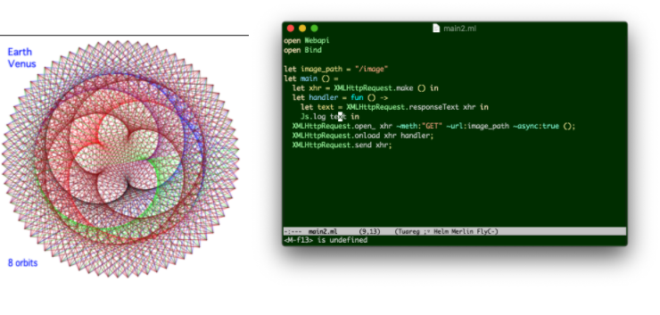

bs_list_images [](https://github.com/mamewotoko/bs_list_images/actions) [](https://travis-ci.org/mamewotoko/bs_list_images)
========================================================================================

Overview
---------

A sample app to get list of images with XMLHTTPRequest, written in BuckleScript (ocaml)

List images in the `image` directry.




Prerequisite
---------------

npm should be installed

How to install
---------------

Install javascript libraries and bucklescript tool

```
npm install
```

How to build sample app
-----------------------

```
npm run build
```

How to run
-----------

### method1: start webpack-dev-server as web server

```
npm run dev
```

Web browser starts and displays index.html


### method2: start web server

1. start web server e.g. with python

```
python3 -m http.server
```

2. browse index.html <http://localhost:8000>

merlin: completion of function name
---------------------------------------

```
opam install merlin
```

In case of Emacs

Key stroke|Command|Action
-----|--------------|--------------
C-c C-l|merlin-locate|jump to defintion
C-c i|merlin-document|display ocamldoc comment

Detail
--------
* This sample used `-r` option of browserify to call function written in bucklescript form script in browser script tag.
  * Reference [external requires](https://github.com/browserify/browserify#external-requires)
  * This option is specified in [package.json](package.json) file.
* [es6](https://github.com/mamewotoko/bs-quickstart/tree/feature/es6)


References
-----------
* [ReScript](https://rescript-lang.org/)


Keyword
---------
bucklescript, bs-webapi, ocaml, browserify, commonjs

License
---------

```
   Copyright 2020 Takashi Masuyama

   Licensed under the Apache License, Version 2.0 (the "License");
   you may not use this file except in compliance with the License.
   You may obtain a copy of the License at

       http://www.apache.org/licenses/LICENSE-2.0

   Unless required by applicable law or agreed to in writing, software
   distributed under the License is distributed on an "AS IS" BASIS,
   WITHOUT WARRANTIES OR CONDITIONS OF ANY KIND, either express or implied.
   See the License for the specific language governing permissions and
   limitations under the License.
```

-----
Takashi Masuyama < mamewotoko@gmail.com >  
http://mamewo.ddo.HP/
